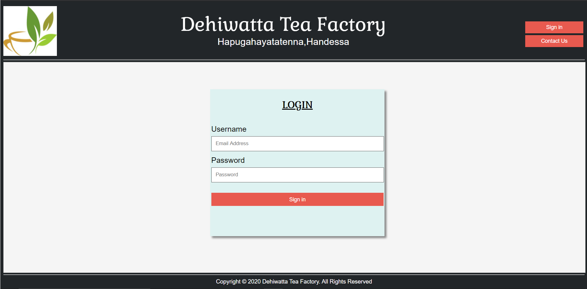

# Factory Managment System

## Table of Contents
* [Introduction](#intro-project)
* [Technologies](#tech)
* [Project Screenshots](#pro)
* [Requirements](#req)
* [Setup](#setup)
* [Team Members](#team-members)
* [Contact](#cont)

## Introduction

This web based “Factory Management System” is design to overcome some of the current manual systems problems and inefficiencies of the tea producing factories. This system is constructed to cover the factory’s overall management processes, such as Purchase Management, Inventory Management, Production Management, Human Resource Management, Sales Management and Payroll Management.  The best part is the web based system makes it easier and possible to monitor the factory processes from any location. 
 
The System is developed to meet user and system requirements. The system would help Tea Factory’s management to be in controlling and handling the operations. It also help factory administration to function efficiently and this newly implemented web based system will allow profit maximization. For this project our client was an tea factory called Dehiwatta tea factory it's located in Kandy, Srilanka. 

## Technologies

Technologies used to create the project
* Front-end : JSP
* Back-end : Servlet
* Database : MySQL 8.0

## Project Screenshots
Example System Screenshots

#### Login page

#### Home pages

#### User profile edit

## Requirements
Required softwares to run the project
* Apache Tomcat Server 8.5 or higher
* MySQL 8.0 or higher
* Eclipse Enterprise IDE

## Setup

1. Clone the Repository in Eclipse IDE
2. Setup tomcat server
3. Configure runtime of tomcat server
4. Setup MySQL databse in eclipse IDE
5. Configure username and password for Database connection in DBconnection.class file
    - Configuration file path located in the project = src -> com.fms.DBconnection package -> DBConnection.java
6. Run the SQL query file in the MySQL database to add database tables
    - SQL query file path located in the project = WebContent -> WEB-INF -> FMS SQL Query -> FMS SQL Queries.sql
8. Run the project in IDE
9. Project will be deployed and run in the tomcatserver 

## Team Members

* M.N.M Akeel (Team leader) - [@AkeelMNM](https://github.com/AkeelMNM)
* M.A.M Nusky - [@nushkymohamed](https://github.com/nushkymohamed)
* H.R Gawesha sathyanjali - [@Sathyanjali](https://github.com/Sathyanjali)
* P.M.F.A Ahamed - [@Track-suite](https://github.com/Track-suite)
* S.Thakshila - [@thakshiselvaraj](https://github.com/thakshiselvaraj)
* R.Rimza - [@rimza19](https://github.com/rimza19)
* Zumry.A.M - [@Zumry](https://github.com/Zumry)

## Contact

- M.N.M Akeel - <akeel1447@gmail.com>
- A.M Zumry - <amzumry@gmail.com>
- M.A.M Nusky - <nuskymohamed1999@gmail.com>
